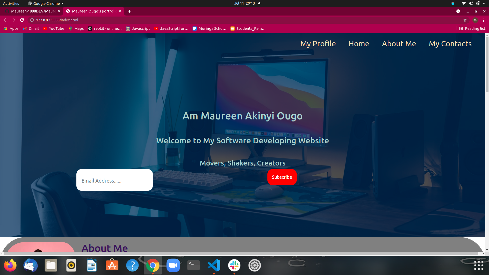
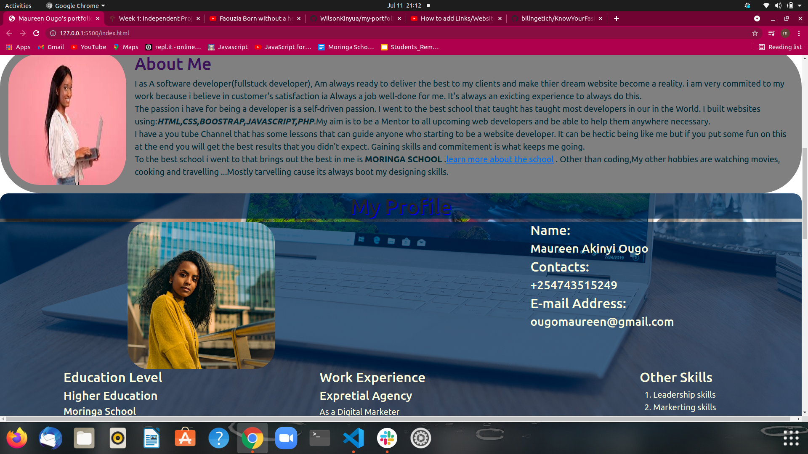
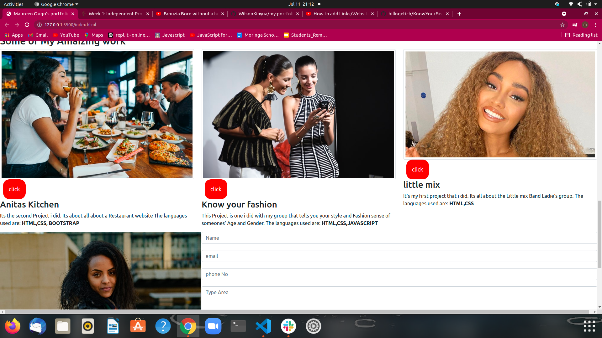
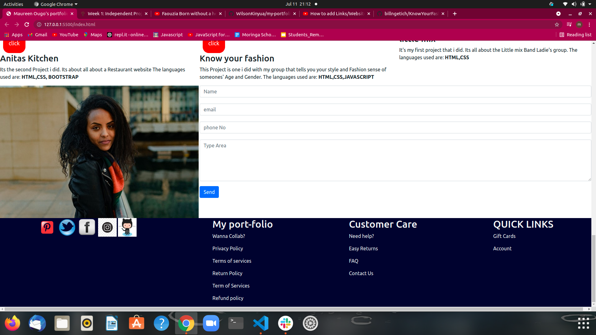

# Authors Name
## Maureen Akinyi Ougo
# Project's Name:
## Maureen Ougo Port-folio Website 
# Project Description:
### It's my first week Project of Moringa School Prep .It's all about My PortFolio as an upcoming webdeveloper.
# Project  set-up Instruction:
* Git
* Web Browser
* GitHub
# Technology Used:
* HTML
* Css
* Boostrap
# Bugs
## No unknown bugs for now.
# Livelink
*  Live link to view the project <a href="">My Portfolio Website</a>
# Screenshots:

